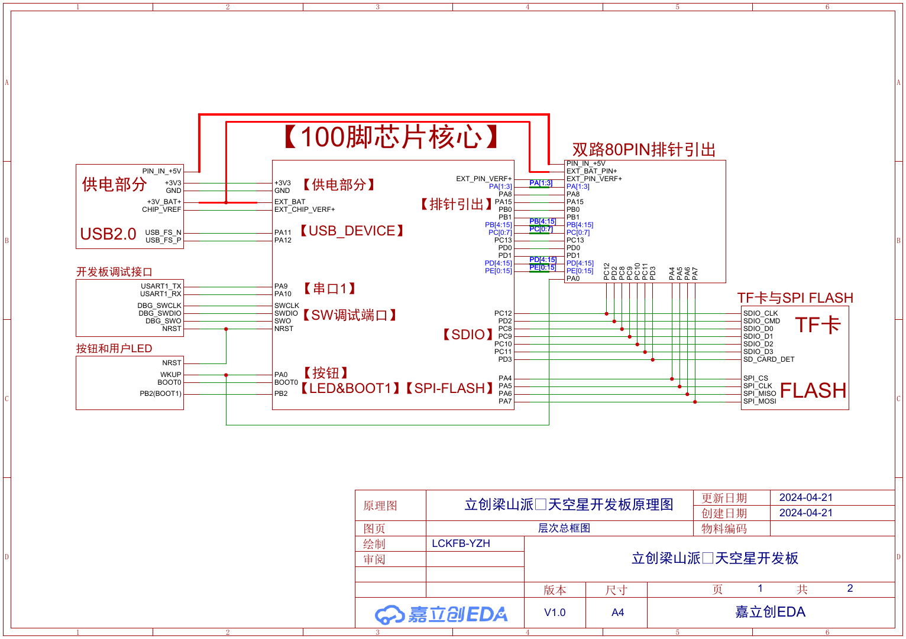

# ARM Cortex-M 开发实验室
## ARM Cortex-M Development Lab

面向 STM32/GD32 Cortex-M 平台的嵌入式固件开发实验仓库。

An embedded firmware development repository focusing on ARM Cortex-M architecture, peripheral drivers and hardware-software integration.

## 👋 项目简介 | Overview

仓库包含 19 个面向 Cortex-M4 的固件工程，围绕启动流程、时钟系统、中断机制和外设数据通路组织。GD32F407 工程使用 CMSIS 与 GD32F4 标准外设库，STM32F407 工程包含 STM32CubeMX 配置和 HAL 初始化代码。

工程按固件机制分类。每个项目保留与源码对应的 Keil 或 CubeMX 配置，可从外设初始化、驱动接口和中断处理路径进入具体实现。

## ⚙ 技术范围 | Technical Scope

### ⚙ 硬件 Hardware

- Cortex-M4 Architecture、Vector Table、SysTick 与 NVIC
- RCU/RCC Clock System、AHB/APB 外设时钟
- SkyStar 核心板、扩展板与外部器件接口

### ⚡ 固件 Firmware

- GPIO、EXTI、Timer 与 PWM
- UART/USART、I²C、SPI 与 DMA
- ADC、RTC、Watchdog 与 PMU
- OLED、PCF8563 与 GD25Q32 外设接口

### 🧩 工程 Environment

- Keil MDK-ARM
- CMSIS、GD32 Standard Peripheral Library 与 STM32 HAL
- STM32CubeMX `.ioc` 配置
- `User`、`Hardware`、`Library`、`Middleware` 模块边界

## 🧠 固件架构 | Firmware Architecture


应用层负责初始化顺序和状态控制；设备模块封装板载器件；驱动层处理 GPIO、通信、定时和 DMA 等外设；CMSIS 与厂商外设库连接启动代码、NVIC、SysTick 和 Cortex-M4 硬件。

```text
Application
    ↓
Hardware Modules / Device Interfaces
    ↓
Peripheral Drivers / Callbacks
    ↓
GD32 SPL / STM32 HAL
    ↓
CMSIS / Startup / NVIC / SysTick
    ↓
Cortex-M4 Hardware
```

GD32 工程主要采用 `User/`、`Hardware/`、`Library/` 和 `Middleware/` 组织模块；CubeMX 工程使用 `Core/`、`Drivers/`、`MDK-ARM/` 与 `.ioc` 文件。详细说明见 [Cortex-M 架构](docs/architecture.md)、[中断系统](docs/interrupt-system.md)和[固件分层](docs/firmware-architecture.md)。

## 🚀 核心项目 | Featured Projects

### [GPIO 与板级输出 | GPIO and Board Output](projects/01_GPIO/)

完成 GPIO 时钟、输出模式和板载 LED 控制，应用序列与硬件接口分离。

`GPIO / RCU / Board Driver`

### [外部中断与 NVIC | EXTI and NVIC](projects/02_INTERRUPT/)

实现 EXTI 路由、NVIC 优先级、Pending Flag 清除、回调分发与 SysTick 按键消抖。

`EXTI / NVIC / Callback / SysTick`

### [定时器与 PWM | Timer and PWM](projects/03_TIMER_PWM/)

配置定时器时基、通道比较值和 PWM 输出，并连接蜂鸣器驱动模块。

`Timer / PWM / Output Compare`

### [UART 与 DMA | UART and DMA](projects/04_UART/)

实现 USART 中断接收、回调分发和基于 DMA 的串口收发数据通路。

`UART / Interrupt / DMA / Buffer`

### [I²C 与 OLED | I²C and OLED](projects/05_SPI_I2C/)

包含软件/硬件 I²C、PCF8563 访问以及 OLED 缓冲区批量更新流程。

`I²C / PCF8563 / OLED / ACK`

### [SPI 与外部 Flash | SPI and External Flash](projects/05_SPI_I2C/#spi-flash-path)

将 SPI 传输与 GD25Q32 指令封装分开，处理片选、命令、地址和数据操作。

`SPI / GD25Q32 / Chip Select`

### [ADC 与 DMA | ADC and DMA](projects/06_ADC_DMA/)

配置 ADC 常规通道扫描、DMA 缓冲区传输和注入通道转换。

`ADC / DMA / Scan Sequence / Injected Channel`

### [RTC、看门狗与低功耗 | RTC, Watchdog and Power](projects/07_FLASH_RTC_POWER/)

覆盖备份域时钟、RTC Alarm、独立看门狗和 PMU 唤醒路径。

`RTC / IWDG / PMU / Wake-up`

STM32CubeMX/HAL 示例和后期固件骨架位于 [HAL 与固件结构](projects/08_HAL_AND_FIRMWARE_ARCHITECTURE/)。完整的 19 个工程清单见[项目筛选说明](docs/project-selection.md)。

## 📂 工程结构 | Repository Structure

```text
ARM-Cortex-M-Development-Lab/
├── assets/images/      # 原理图与固件架构图
├── course/             # 源码组织说明
├── docs/               # 架构、时钟、中断与外设文档
└── projects/           # 按固件机制划分的 19 个工程
    ├── 01_GPIO/
    ├── 02_INTERRUPT/
    ├── 03_TIMER_PWM/
    ├── 04_UART/
    ├── 05_SPI_I2C/
    ├── 06_ADC_DMA/
    ├── 07_FLASH_RTC_POWER/
    └── 08_HAL_AND_FIRMWARE_ARCHITECTURE/
```

各项目的原始工程保存在 `projects/**/course/`，Keil 工程、启动文件、CMSIS、厂商库和应用代码保持相互对应。

## 🛠 开发环境 | Development Environment

- **GD32F407VE**：主要目标平台，覆盖 SWD、调试串口、USB Device、LED/按键、SDIO、SPI Flash 和扩展接口。
- **STM32F407**：提供标准库及 STM32CubeMX/HAL 对照工程，`.ioc` 文件面向 STM32F407 LQFP100 设备。
- **IDE**：Keil MDK-ARM；HAL 工程可使用 STM32CubeMX 查看或调整外设配置。



打开工程前需要安装对应 Device Pack，并确认目标芯片、启动文件、Include Paths、Flash Algorithm 和调试器配置。Keil 工程位于各项目的 `course/Project/` 或 `course/MDK-ARM/` 目录。详细配置见[开发环境说明](docs/development-environment.md)。

## 📖 技术文档 | Documentation

- [Cortex-M 工程架构](docs/architecture.md)
- [时钟系统](docs/clock-system.md)
- [中断系统](docs/interrupt-system.md)
- [固件分层](docs/firmware-architecture.md)
- [外设资源关系](docs/peripheral-map.md)
- [工程筛选与完整性记录](docs/project-selection.md)

## 📜 来源与许可 | Source and License

项目源码快照保存在 `projects/**/course/`，文件级 SHA-256 记录见 [`docs/course-source-sha256.csv`](docs/course-source-sha256.csv)。第三方组件、硬件资料与图片来源见 [THIRD_PARTY_NOTICES.md](THIRD_PARTY_NOTICES.md) 和 [`assets/images/SOURCES.md`](assets/images/SOURCES.md)。

相关仓库：[Embedded Systems Foundations](https://github.com/REliasCheng/Embedded-Systems-Foundations) · [Embedded C/C++](https://github.com/REliasCheng/Embedded-C-Cpp-Learning) · [STC89C52](https://github.com/REliasCheng/stc89c52-learning) · [STC8](https://github.com/REliasCheng/STC8-MCU-Learning)
