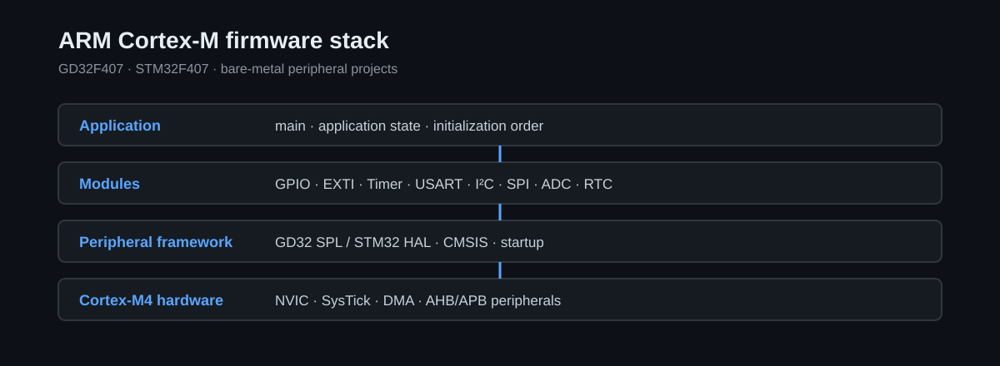

# ARM-Cortex-M-Development-Lab

面向 GD32F407 与 STM32F407 Cortex-M4 平台的裸机固件工程集合，重点展示启动流程、中断路径、外设驱动、DMA 数据通路和固件分层。

## Overview

仓库按 Cortex-M4 固件机制组织独立工程，覆盖系统启动、时钟配置、NVIC 与中断处理，以及 GPIO、Timer、UART、I²C、SPI、ADC、RTC、Watchdog 和低功耗等外设路径。

GD32F407 工程使用 CMSIS 与 GD32F4 标准外设库；STM32F407 工程包含 STM32CubeMX 配置和 HAL 初始化代码。两类平台的目标器件、厂商库和工程配置保持各自边界，不被描述成单一的集成固件。

## Platform & Technology

| Field | Value |
| --- | --- |
| Language | C, startup assembly |
| Platform | GD32F407VE, STM32F407, ARM Cortex-M4 |
| Toolchain | Keil MDK-ARM, STM32CubeMX |
| Architecture | Bare-metal firmware, CMSIS, GD32 SPL, STM32 HAL |
| Verification | Source and configuration review; build and hardware status are listed below |

## Architecture



```text
Application / System State
            ↓
Board Modules / Device Interfaces
            ↓
Peripheral Drivers / Callbacks / DMA
            ↓
GD32 SPL / STM32 HAL
            ↓
CMSIS / Startup / NVIC / SysTick
            ↓
Cortex-M4 Hardware
```

GD32 工程主要使用 `User/`、`Hardware/`、`Library/`、`Middleware/` 和 `Firmware/` 组织模块；CubeMX 工程使用 `Core/`、`Drivers/`、`MDK-ARM/` 与 `.ioc` 文件。各工程独立配置时钟、引脚、中断和 DMA 资源。

## Key Features

| Capability | Implementation Entry |
| --- | --- |
| Startup and clock path | [Cortex-M 工程架构](docs/architecture.md) 与 [时钟系统](docs/clock-system.md) 说明 Vector Table、启动代码、PLL 和总线时钟关系 |
| Interrupt and callback flow | [EXTI and NVIC](projects/02_INTERRUPT/) 与 [中断系统](docs/interrupt-system.md) 展示 Pending Flag、NVIC、ISR 和回调路径 |
| Buffered data movement | [UART and DMA](projects/04_UART/) 与 [ADC and DMA](projects/06_ADC_DMA/) 展示中断接收和 DMA 缓冲区传输 |
| Serial device interfaces | [I²C and SPI](projects/05_SPI_I2C/) 连接 PCF8563、OLED 与 GD25Q32 等设备接口 |
| Firmware layer boundaries | [HAL and firmware architecture](projects/08_HAL_AND_FIRMWARE_ARCHITECTURE/) 与 [固件分层](docs/firmware-architecture.md) 展示应用、板级模块、驱动和厂商库边界 |

## Project Structure

```text
ARM-Cortex-M-Development-Lab/
├── projects/01_GPIO/                          # GPIO 与板级输出
├── projects/02_INTERRUPT/                     # EXTI、NVIC 与回调
├── projects/03_TIMER_PWM/                     # Timer 与 PWM
├── projects/04_UART/                          # UART、中断与 DMA
├── projects/05_SPI_I2C/                       # I²C、SPI 与外部器件
├── projects/06_ADC_DMA/                       # ADC 扫描与 DMA
├── projects/07_FLASH_RTC_POWER/               # RTC、Watchdog 与低功耗
├── projects/08_HAL_AND_FIRMWARE_ARCHITECTURE/ # STM32 HAL 与固件分层
├── docs/                                      # 架构、时钟、中断和外设文档
└── assets/images/                             # 已有架构图与来源记录
```

这些目录是按固件机制归类的独立工程入口。组合模块前，需要重新核对目标芯片、时钟树、GPIO Alternate Function、DMA 映射、中断优先级和共享缓冲区。

## Documentation

- [Cortex-M 工程架构](docs/architecture.md)
- [时钟系统](docs/clock-system.md)
- [中断系统](docs/interrupt-system.md)
- [固件分层](docs/firmware-architecture.md)
- [外设资源关系](docs/peripheral-map.md)
- [开发环境](docs/development-environment.md)

## Verification

| Verification Type | Status | Boundary |
| --- | --- | --- |
| Host Test | N/A | 工程面向 Cortex-M4 MCU，不包含 Host Test 入口 |
| Build Verification | NOT VERIFIED | 本次 README 调整未执行 Keil 或 CubeMX 工程构建，仓库未提供当前公开快照的可复现构建日志 |
| Hardware Validation | NOT VERIFIED | 当前公开文档未提供可复核的 GD32F407 或 STM32F407 板端测试记录 |
| Runtime Evidence | NOT INCLUDED | 当前仓库未提供串口日志、波形、测量结果或调试记录作为运行证据 |

工程文件和 `.ioc` 配置存在，不等同于当前构建或硬件验证通过。打开工程前需要按[开发环境](docs/development-environment.md)核对目标器件、Device Pack、启动文件、Include Paths、Flash Algorithm 和调试器配置。

## License Boundary

根目录 `LICENSE` 仅适用于其明确覆盖的仓库新增内容，不改变示例源码、CMSIS、厂商库和硬件资料各自的权利状态。第三方组件及硬件资料边界见 [THIRD_PARTY_NOTICES.md](THIRD_PARTY_NOTICES.md)，现有图片来源见 [assets/images/SOURCES.md](assets/images/SOURCES.md)。
