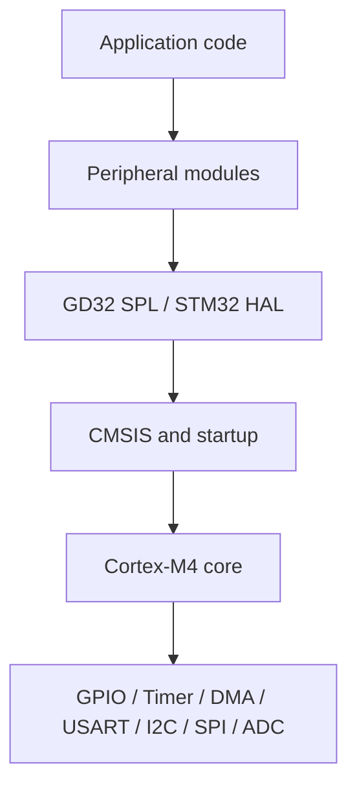

# ARM Cortex-M Development Lab

ARM Cortex-M firmware projects for GD32F4 and STM32F4, covering peripheral drivers, interrupt-driven design, DMA, communication interfaces and firmware modularization.


## Overview

仓库围绕 Cortex-M4 工程的启动、时钟、异常与外设访问组织 19 个代表工程。项目以 GD32F407 为主，并保留 STM32F407 标准库与 STM32CubeMX/HAL 配置用于接口对照。

课程工程位于各项目的 `course/` 目录；文档从工程文件、源码和板卡原理图提取接口关系。编译输出、安装程序、完整数据手册和重复示例不进入仓库。



## Platforms

- **GD32F407VE** — Cortex-M4 + FPU，Keil MDK 与 GD32F4 标准外设库；天空星核心板和扩展板是主要硬件参考。
- **STM32F407** — 标准外设库工程与 STM32CubeMX/HAL 工程；CubeMX 文件使用 `STM32F407V(E-G)Tx`、LQFP100 配置。
- **GD32F427RKT6 hardware reference** — 资料中存在原理图与 PCB 工程，但本仓库不包含制造文件或板级测试结果。

## Technical scope

**Core and hardware**

- Cortex-M startup, vector table and CMSIS
- RCU/RCC clock configuration and peripheral clocks
- GPIO modes, EXTI and NVIC priority

**Firmware**

- Timer channels, PWM and watchdogs
- Interrupt-driven USART and DMA transfers
- Software/hardware I²C, SPI and external Flash
- ADC regular/injected groups and DMA scanning
- RTC backup domain and PMU modes

**Project structure**

- GD32 standard peripheral library projects
- STM32CubeMX `.ioc` and HAL projects
- Hardware, middleware and application-facing interfaces

RTOS content in the source material is conceptual; no RTOS application is presented here.

## Project navigation

| Area | Representative projects |
| --- | --- |
| [GPIO](projects/01_GPIO/) | Optimized LED and board-level output sequence |
| [Interrupts](projects/02_INTERRUPT/) | EXTI, NVIC priority, callbacks and SysTick debounce |
| [Timer / PWM](projects/03_TIMER_PWM/) | Timer wrapper, PWM channel control and buzzer output |
| [UART](projects/04_UART/) | IRQ callbacks and USART DMA TX/RX |
| [SPI / I²C](projects/05_SPI_I2C/) | PCF8563, OLED buffered updates and GD25Q32 Flash |
| [ADC / DMA](projects/06_ADC_DMA/) | Regular scan with DMA and injected conversion |
| [Flash / RTC / Power](projects/07_FLASH_RTC_POWER/) | RTC alarm, independent watchdog and PMU modes |
| [HAL / Firmware architecture](projects/08_HAL_AND_FIRMWARE_ARCHITECTURE/) | CubeMX/HAL examples and middleware-oriented debug skeleton |

The complete selection rationale is documented in [`docs/project-selection.md`](docs/project-selection.md).

## Architecture

The retained projects expose two firmware styles:

```text
GD32 path                         STM32 path
Application                      Application
    ↓                                ↓
Hardware / Middleware modules    HAL callbacks and generated init
    ↓                                ↓
GD32F4 SPL                       STM32F4 HAL
    ↓                                ↓
CMSIS + startup                  CMSIS + startup
```

See [`docs/architecture.md`](docs/architecture.md), [`docs/clock-system.md`](docs/clock-system.md) and [`docs/peripheral-map.md`](docs/peripheral-map.md).

## Development environment

- Keil MDK-ARM is the primary project environment.
- GD32 projects require a matching GD32F4 device pack and standard peripheral library.
- STM32 HAL projects include CubeMX `.ioc` files and Keil project files.
- Several STM32-named Keil projects retain a GD32 device-pack selection in the original configuration; verify the target before building.

Build steps and configuration notes are in [`docs/development-environment.md`](docs/development-environment.md).

## Source and license

Source attribution and third-party components are recorded in [`THIRD_PARTY_NOTICES.md`](THIRD_PARTY_NOTICES.md). The root MIT license applies to repository-authored documentation and future personal implementations, not to third-party code with separate terms.

