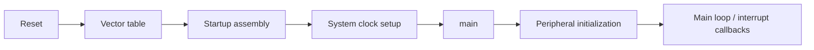

# Cortex-M 固件架构 | Firmware Architecture

## 启动流程 | Startup

保留的裸机工程遵循 Cortex-M 的标准启动路径：



启动文件提供向量表和复位入口，CMSIS 定义内核寄存器与异常接口，厂商外设库提供 GD32 RCU/GPIO/USART 或 STM32 HAL 初始化接口。

## 中断路径 | Interrupt Path

外设事件通过 NVIC 进入 ISR。使用回调的工程把外设初始化与应用动作分开：

```text
GPIO edge / USART receive / timer update
                  ↓
          peripheral status flag
                  ↓
               NVIC
                  ↓
                 ISR
                  ↓
       clear flag / move data
                  ↓
       callback or application state
```

EXTI 和 USART 工程保留了从 ISR 直接处理到回调注册与接口复用的代码路径。

## 数据搬运 | Data Movement

DMA 工程配置源地址、目标地址、传输宽度、方向和完成处理。USART DMA 将字节搬运从前台轮询中分离；ADC 扫描使用 DMA 将转换序列写入内存。

## 工程组织 | Project Layout

GD32 工程常见目录：

- `Firmware/`：CMSIS 与 GD32F4 外设支持。
- `Hardware/`：LED、按键、USART、定时器、显示和传感器等板级模块。
- `Middleware/`：后期调试工程中的协议与服务接口。
- `User/`：`main.c`、中断处理和应用流程。
- `Project/`：Keil 目标配置。

CubeMX 工程使用 `Core/`、`Drivers/`、`MDK-ARM/` 和 `.ioc` 配置文件。

## 范围 | Scope

迁移工程均为裸机固件。实时调度、任务通信与同步机制在独立的 [FreeRTOS Embedded Lab](https://github.com/REliasCheng/FreeRTOS-Embedded-Lab) 中组织。
