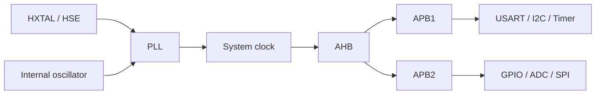

# 时钟系统 | Clock System

## 时钟域 | Clock Domains

GD32F4 工程通过 RCU 配置时钟，STM32F4 工程使用 RCC 或 CubeMX 生成的 HAL 初始化代码。两类平台都需要选择时钟源、配置 PLL 和系统时钟、启用总线时钟，并由此计算外设时序。

PLL 倍频和总线分频保留在各自工程中；GD32 与 STM32 的库和目标配置不同，不在仓库中统一改写。

## 外设时钟 | Peripheral Clocks

配置外设寄存器前，需要先打开对应的 RCU/RCC 时钟门控。GPIO、DMA 与通信外设可能位于不同总线，因此时钟使能分布在各自初始化函数中。

定时器输入时钟在 APB 分频后可能与可见的 APB 时钟不同。PWM 频率由定时器时钟、预分频值和自动重装值共同决定。

## RTC 时钟 | RTC Clocking

RTC 工程对照外部低速时钟与内部低速振荡器，并涉及备份域、预分频和 Alarm 中断路径。保留的 RTC Alarm 工程把这些关系放在同一 Keil 目标中。

## 低功耗唤醒 | Low-Power Recovery

PMU 工程进入低功耗模式后需要处理唤醒后的时钟状态。时钟源选择和外设恢复与目标平台相关，修改参数时应同时核对工程配置和厂商参考手册。
