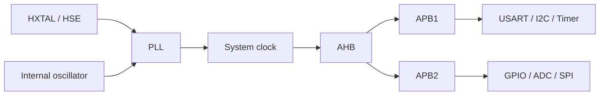

# Clock system

## Clock domains

GD32F4 projects configure clocks through RCU, while STM32F4 projects use RCC or CubeMX-generated HAL initialization. Both platforms expose the same design problem: select a clock source, configure the PLL/system clock, enable bus clocks and derive peripheral timing.

Exact PLL factors and bus dividers remain part of each course project. They are not normalized across GD32 and STM32 because the original examples target different libraries and configurations.

## Peripheral clocks

Before a peripheral register is configured, its corresponding RCU/RCC gate must be enabled. GPIO ports, DMA controllers and communication peripherals may belong to different buses; their clock enable calls therefore appear in separate initialization functions.

Timer clock derivation requires additional attention because the timer input clock can differ from the visible APB clock after prescaling. PWM frequency is then determined by the timer clock, prescaler and auto-reload value.

## RTC clocking

The RTC examples compare an external low-speed source with the internal low-speed oscillator. RTC configuration also interacts with the backup domain, prescalers and alarm interrupt path. The retained RTC alarm project keeps those relationships visible in one Keil target.

## Low-power recovery

The PMU example enters low-power modes and must account for clock state after wake-up. Source selection and peripheral reinitialization are platform-specific; refer to the selected project and the vendor reference manual when changing clock parameters.

