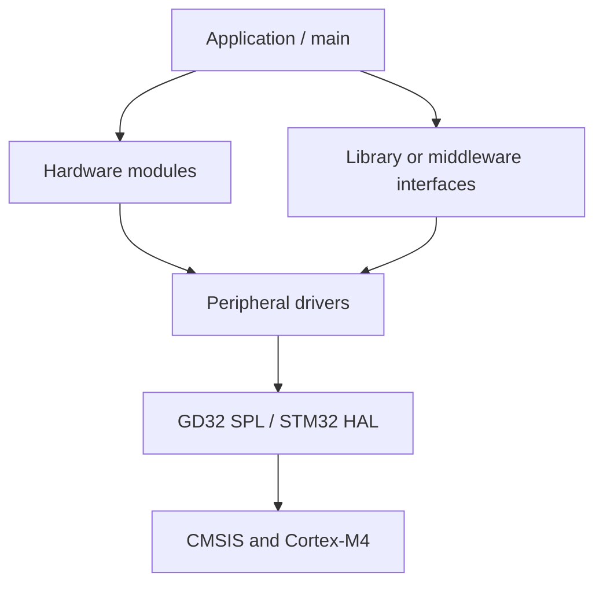

# 固件分层 | Firmware Architecture

## 层次边界 | Layer Boundaries

保留的 GD32 工程从直接外设访问逐步拆分出板级模块和协议接口：



`main.c` 负责初始化顺序和应用流程；`Hardware/` 对应 LED、蜂鸣器、OLED 和 Flash 等板级器件；`Library/` 或 `Middleware/` 提供 EXTI、USART、Timer、I²C 和 SPI 接口；厂商代码提供寄存器定义与外设操作。

## GD32 工程结构

```text
User/          main、SysTick 与中断处理
Hardware/      板级器件模块
Library/       可复用外设接口
Middleware/    后期工程中的协议/服务边界
Firmware/      CMSIS 与 GD32F4 外设库
Project/       Keil 目标配置
```

调试骨架工程使用 `Hardware/` 与 `Middleware/` 分隔 EXTI、I²C、SPI 和 USART/DMA 代码。

## STM32 CubeMX/HAL 结构

```text
Core/          生成的初始化与应用入口
Drivers/       CMSIS 与 STM32 HAL
MDK-ARM/       Keil 目标与启动文件
*.ioc          引脚、时钟和外设配置
```

CubeMX 管理初始化代码和回调入口。需要重新生成工程时，应用代码应保存在用户代码区或独立模块中。

## 数据归属 | Data Ownership

- 中断处理函数确认事件并搬运必要数据。
- DMA 传输期间，配置的缓冲区由对应传输路径占用。
- 器件模块管理 PCF8563 寄存器或 GD25Q32 指令等协议细节。
- 应用层保存系统状态并决定模块调用顺序。

各项目保持独立。组合模块前需要重新核对引脚、时钟、DMA 通道、中断优先级和共享缓冲区。
