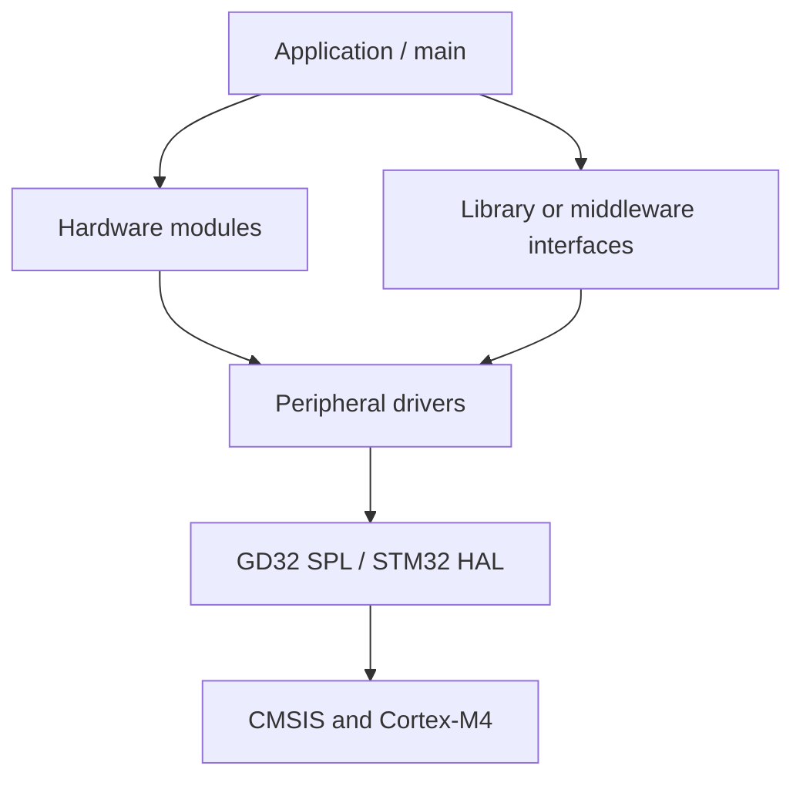

# Firmware architecture

## Layer boundaries

The selected GD32 projects evolve from direct peripheral access toward explicit board and protocol modules:



`main.c` owns initialization order and application flow. `Hardware/` maps board devices such as LEDs, buzzers, OLED and Flash. `Library/` or `Middleware/` contains reusable EXTI, USART, timer, I²C and SPI interfaces. Vendor code provides register definitions and peripheral operations.

## GD32 project shape

```text
User/          main, SysTick and interrupt handlers
Hardware/      board and device modules
Library/       reusable peripheral interfaces
Middleware/    later protocol/service boundary
Firmware/      CMSIS and GD32F4 peripheral library
Project/       Keil target configuration
```

The debug skeleton shows the later `Hardware/` and `Middleware/` split across EXTI, I²C, SPI and USART/DMA code.

## STM32 CubeMX/HAL shape

```text
Core/          generated initialization and application entry
Drivers/       CMSIS and STM32 HAL
MDK-ARM/       Keil target and startup files
*.ioc          pin, clock and peripheral configuration
```

CubeMX owns initialization code and callback hooks. Application changes should remain inside generated user-code sections or separate modules if the project is regenerated.

## Data ownership

- Interrupt handlers acknowledge events and move the minimum required data.
- DMA owns configured transfer buffers while a transfer is active.
- Device modules own protocol details such as PCF8563 registers or GD25Q32 commands.
- Application code owns system state and decides when modules are invoked.

The repository keeps each project independent. Combining them requires a new resource map for pins, clocks, DMA channels, interrupt priorities and shared buffers.

