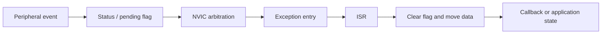

# Interrupt system

## Event path

Cortex-M peripheral events reach firmware through a consistent path:

The selected projects exercise this path with GPIO edges, USART receive events, timer updates, DMA completion and RTC alarms.

## EXTI routing

The EXTI project configures a GPIO input, maps the pin to an EXTI line, selects the trigger edge and enables the matching NVIC channel. The handler checks the pending flag, clears it and dispatches the registered action. SysTick timing is used in the button path so debounce does not depend on an unbounded delay inside the ISR.

Key files:

- [`EXTI.c`](../projects/02_INTERRUPT/exti-callback/course/Library/EXTI.c)
- [`EXTI.h`](../projects/02_INTERRUPT/exti-callback/course/Library/EXTI.h)
- [`gd32f4xx_it.c`](../projects/02_INTERRUPT/exti-callback/course/User/gd32f4xx_it.c)

## USART and DMA interrupts

USART receive handlers read or transfer incoming data, update a receive buffer and hand control to a callback. The DMA project adds transfer configuration and completion handling so the CPU does not move every byte in the foreground loop.

Key files:

- [`USART0.c`](../projects/04_UART/uart-callback/course/Library/USART0.c)
- [`DMA USART0.c`](../projects/04_UART/uart-dma/course/Library/USART0.c)
- [`DMA interrupt handlers`](../projects/04_UART/uart-dma/course/User/gd32f4xx_it.c)

## Priority and handler rules

- Configure priority grouping before assigning preemption and subpriority values.
- Clear the peripheral or EXTI pending condition handled by the ISR.
- Keep blocking transfers and long delays outside interrupt context.
- Share data with foreground code through explicit buffers, flags or callbacks.
- Reconcile shared IRQ lines before combining independent projects.

