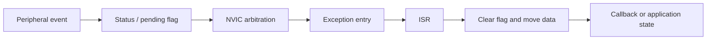

# 中断系统 | Interrupt System

## 事件路径 | Event Path

Cortex-M 外设事件通过以下路径进入固件：

保留工程包含 GPIO 边沿、USART 接收、Timer 更新、DMA 完成和 RTC Alarm 等中断路径。

## EXTI 路由 | EXTI Routing

EXTI 工程配置 GPIO 输入、引脚到 EXTI Line 的映射、触发边沿和对应 NVIC Channel。处理函数检查并清除 Pending Flag，再分发注册的动作。按键路径使用 SysTick 计时，避免在 ISR 中使用无界延时完成消抖。

关键文件：

- [`EXTI.c`](../projects/02_INTERRUPT/exti-callback/course/Library/EXTI.c)
- [`EXTI.h`](../projects/02_INTERRUPT/exti-callback/course/Library/EXTI.h)
- [`gd32f4xx_it.c`](../projects/02_INTERRUPT/exti-callback/course/User/gd32f4xx_it.c)

## USART 与 DMA 中断

USART 接收处理读取输入数据、更新缓冲区并进入回调。DMA 工程增加传输配置和完成处理，避免 CPU 在前台逐字节搬运。

关键文件：

- [`USART0.c`](../projects/04_UART/uart-callback/course/Library/USART0.c)
- [`DMA USART0.c`](../projects/04_UART/uart-dma/course/Library/USART0.c)
- [`DMA interrupt handlers`](../projects/04_UART/uart-dma/course/User/gd32f4xx_it.c)

## 优先级与处理规则

- 分配抢占优先级和响应优先级前先配置 Priority Grouping。
- 处理完成后清除对应的外设或 EXTI Pending Flag。
- 阻塞传输和长延时留在中断上下文之外。
- 通过明确的缓冲区、标志或回调与前台代码共享数据。
- 合并独立工程前先处理共用 IRQ Handler。
