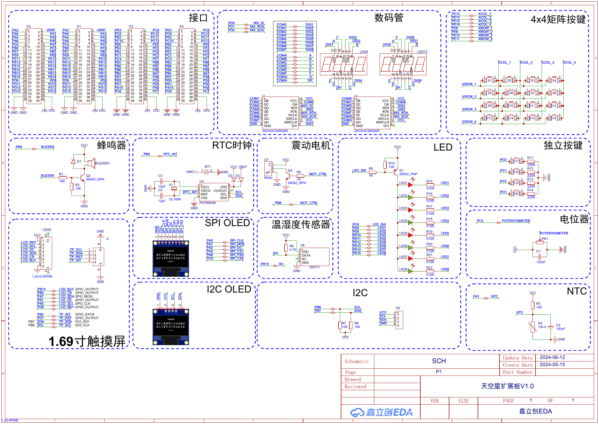

# Peripheral map

## Functional map

| Function | Cortex-M / bus resource | Selected implementation |
| --- | --- | --- |
| Board outputs | GPIO | Optimized LED sequence |
| External events | GPIO + EXTI + NVIC | EXTI callback library |
| Periodic output | Timer channel + GPIO AF | PWM buzzer project |
| Serial communication | USART + NVIC | USART callback project |
| Buffered serial transfer | USART + DMA + NVIC | USART DMA driver |
| Two-wire devices | GPIO bit-bang or hardware I²C | PCF8563 and OLED projects |
| Synchronous serial bus | SPI + chip select GPIO | GD25Q32 Flash project |
| Analog acquisition | ADC regular/injected groups | ADC DMA and injected examples |
| Calendar and alarm | RTC + backup domain + EXTI | RTC alarm project |
| Reliability | FWDGT | Independent watchdog project |
| Power control | PMU + system clock | Low-power mode project |

## Board resources

The SkyStar core board exposes SWD, debug USART, USB device, user LED/button, SDIO/TF, SPI Flash and expansion headers. The extension board adds a 74HC595-driven display, matrix keys, PCF8563 RTC, buzzers, OLED interfaces and analog inputs.

## Shared resources

Pin multiplexing, DMA channels and interrupt priorities are configured per project. Before combining examples, check:

1. GPIO alternate-function selection and electrical mode.
2. APB/AHB clock gates and timer clock derivation.
3. NVIC priority grouping and shared interrupt handlers.
4. DMA controller, stream/channel mapping and transfer direction.
5. SPI/I²C chip-select or device-address ownership.

The projects are intentionally kept as independent targets; resource assignments should be reconciled before modules are merged.

