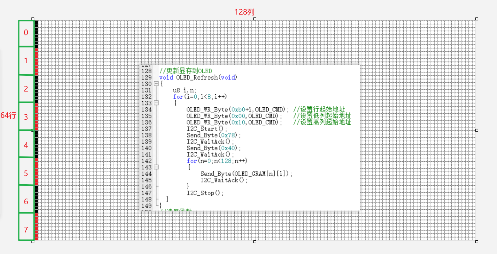

# SPI、I²C 与显示器件 | SPI, I²C and Display Devices

## 代表工程 | Selected Projects

- [`i2c-pcf8563/course/`](i2c-pcf8563/course/)：软件/硬件 I²C 与 PCF8563 器件接口。
- [`oled-i2c-buffered/course/`](oled-i2c-buffered/course/)：OLED Frame Buffer 与批量 I²C 写入。
- [`gd25q32-spi-flash/course/`](gd25q32-spi-flash/course/)：SPI 传输与 GD25Q32 Flash 操作。

## 总线边界 | Bus Boundaries

```text
Application
    ↓
Device interface: PCF8563 / OLED / GD25Q32
    ↓
Bus interface: I²C or SPI
    ↓
GPIO alternate function, clock and interrupt resources
```



设备地址、片选极性和总线时序由对应工程及所接硬件决定。

## I²C 路径

PCF8563 与 OLED 位于 I²C 接口之上。器件代码管理寄存器地址和显示命令，总线层管理 START/STOP、地址传输、ACK 与字节收发。

关键文件：[`I2C0.c`](i2c-pcf8563/course/Library/I2C0.c)、[`PCF8563.c`](i2c-pcf8563/course/Hardware/PCF8563.c)、[`I2C.c`](oled-i2c-buffered/course/Library/I2C/I2C.c) 和 [`oled.c`](oled-i2c-buffered/course/Hardware/OLED/oled.c)。

<a id="spi-flash-path"></a>

## SPI / Flash 路径

Flash 工程将 SPI 传输与 GD25Q32 指令分开。总线层配置 CPOL/CPHA 和字节传输，器件层管理片选、命令、地址与数据操作。

关键文件：[`SPI0.c`](gd25q32-spi-flash/course/Library/SPI0.c)、[`spi_flash.h`](gd25q32-spi-flash/course/Hardware/spi_flash.h) 和 [`spi_flash.c`](gd25q32-spi-flash/course/Hardware/spi_flash.c)。
